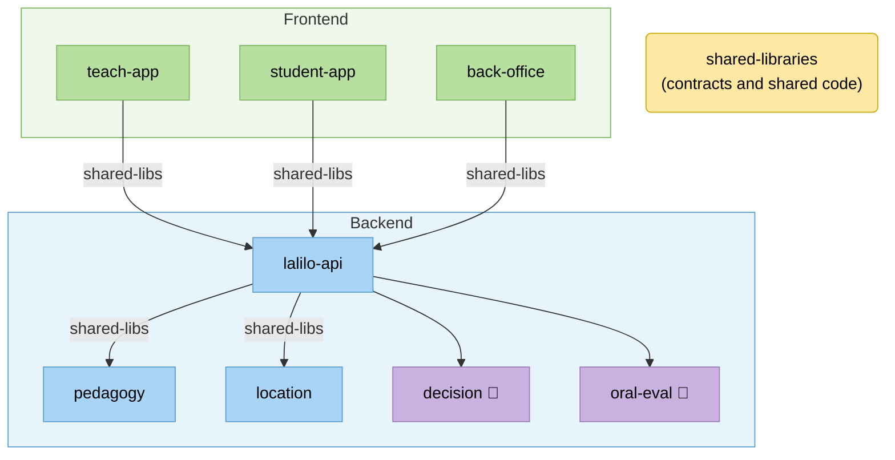
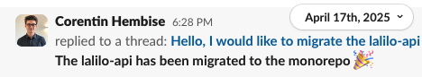
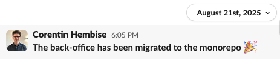
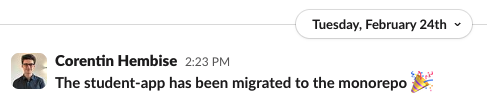
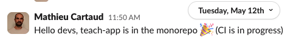

# Monorepo migration

<div class="opacity-80">How we unified Lalilo's codebase and why it matters</div>

<div class="mt-8 flex justify-center gap-2 items-center opacity-60">
  <carbon:logo-github class="text-2xl" />
  <span class="text-sm">lalalilo/monorepo</span>
</div>

---
layout: center
---

# Some Tech Context

<div class="grid grid-cols-2 gap-x-12 mt-4 text-sm">
<div>

**Repository (repo)**
A versioned folder containing a project's code. Each repo is independent with its own history, its own dependencies.

**Pull Request (PR)**
A proposal to merge a set of code changes into the main codebase.

A PR is scoped to one repo, so updating 2 repos means 2 separate PRs.

</div>
<div>

**Lifecycle of a PR**

```
Open PR
  ↓
Automated tests run
  ↓
Code review
  ↓
[Iterations if changes requested]  ← resets approval
  ↓
Validation
  ↓
[Iterations if issues found]  ← resets approval
  ↓
Deploy
```

</div>
</div>

---
layout: center
---

# Before: Separate Repositories



<p class="text-sm opacity-60 mt-2 text-center">shared-libraries published as packages imported in other repositories; a manual upgrade is necessary in every repo for each new release</p>

---
layout: center
---

# Before: Deploying a Feature

<div class="grid grid-cols-2 gap-x-12 gap-y-1 mt-4 text-sm">
<div>

1. `shared-libraries` PR: update contract
2. Release a dev version of `shared-libraries` for testing
3. `pedagogy` PR: upgrade to dev version, write feature
4. `lalilo-api` PR: upgrade to dev version, write feature
5. `teach-app` / `student-app` PR: upgrade to dev version, write feature
6. **4 code reviews**
7. Iterations based on feedback: new dev versions, updated PRs, repeat

</div>
<div>

8. **Validation by PMs**
9. Iterations based on feedback: new dev versions, updated PRs, repeat
10. Deploy `shared-libraries` → official version published
11. Update all backend & frontend PRs to official version
12. **New approval required on each PR**
13. Deploy `pedagogy`
14. Deploy `lalilo-api`
15. Deploy `teach-app` / `student-app`

</div>
</div>

---
layout: center
---

# Before: The Problem

- Same logic re-implemented across projects because sharing code was too cumbersome
- Shared-libraries changes frequently blocked other devs: publishing a new version early blocked others until everything was deployed; using dev versions was manual, error-prone, and still required re-approval after the final package release
- Nothing enforced updating all consumers when a shared package changed, so breakages were discovered late
- No centralized config (formatter, CI config, etc.): inconsistent practices across repos
- Deployments had to be sequenced manually across repos, with no tooling to enforce order

---
layout: center
---

# Migration Timeline

<div class="mt-6 text-sm">

| Date | Milestone |
|------|-----------|
| Nov 2024 | ADR written: decision to migrate to monorepo |
| Feb 2025 | Initial monorepo created, `pedagogy` and `location` imported |
| Mar 2025 | Turborepo set up (build orchestration tool), CI wired |
| Apr 2025 | `lalilo-api` imported |
| Aug 2025 | `back-office` imported |
| Feb 2026 | `student-app` imported, CI fully adapted to Turbo |
| Apr 2026 | `shared-libraries`: `node-utils` imported |
| May 2026 | `teach-app` + all `shared-libraries` imported (`api-interfaces`, `enums`, `exercises`, `front-utils`) |

</div>

---
layout: center
---

# After: The Monorepo

```
monorepo/
├── apps/
│   ├── lalilo-api/
│   ├── teach-app/
│   ├── student-app/
│   ├── back-office/
│   ├── location/
│   ├── pedagogy/
│   └── renintel-mock/
├── packages/
│   ├── api-interfaces/
│   ├── enums/
│   ├── exercises/
│   ├── front-utils/
│   ├── node-utils/
│   └── showcase/
├── turbo.json
└── package.json
```

Still separate (Python): `oral-eval` and `decision`

---
layout: center
---

# After: Deploying a Feature

<div class="mt-6 text-sm">

1. One PR covering all changes: contract, backend, frontend
2. **One code review**
3. Iterations based on feedback
4. **Validation by PMs**
5. Iterations based on feedback
6. **One final approval**
7. One merge triggers the sequential deployment

</div>

---
layout: center
---

# After: The Benefits

- **Code sharing is easy**: no more re-implementing the same logic, packages are local and always in sync
- **No more manual versioning overhead**: shared package changes are atomic, one PR, one review, no dev versions, no re-approvals
- **Consistent practices are now possible**: centralized config for formatting, CI, linting
- **Automated deployment order**: Turborepo enforces sequencing
- **AI-assisted full-stack tasks**: with the entire codebase in one place, AI tools can implement consistent end-to-end changes without context-switching between repos (also true for documentation with LaliKnows bot)

---
layout: center
---

# Drawbacks

- **Migration took over a year** (Nov 2024 to May 2026) <span class="text-green-400">... but each milestone brought immediate benefits to the team</span>
- **CI is more complex**: harder to ensure services deploy in the right order <span class="text-green-400">... but deployment sequencing is now automated</span>
- **Large dependency upgrades**: the upgrade must be done everywhere at the same time <span class="text-green-400">... but at least we don't forget some repos</span>
- **Rollbacks are trickier**: a single merge can touch multiple services <span class="text-green-400">... but we are working on it</span>

---
layout: center
---

# Celebration 🎉

<div class="grid grid-cols-2 gap-4 mt-6">
  
  
  
  
  
</div>

---
layout: center
---

# What's Next

- **Rollback improvements**: improve rollback process for multi-service merges
- **CI improvements**:
  - Improve speed with caching
  - Simplify workflow
- **Code sharing**:
  - Share more code between frontend apps and between backend services
  - Standardise configs across projects
- **Cleanups**:
  - Improve onboarding process and documentation
  - Clean up shared-libraries documentation

---
layout: center
class: text-center
---

# Questions?
